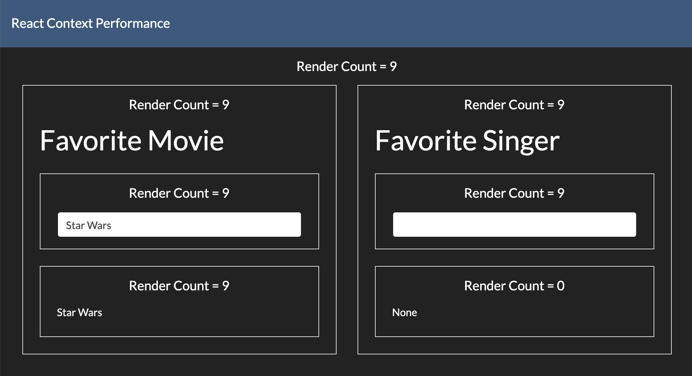

# React Context Performance

Sample app to demonstrate React Context rendering behavior.



## Build

```bash
$ yarn
$ yarn start
```

Now point your browser to http://localhost:3000/. Start typing and see render
counts for various components. These counts represent calls to render methods of
the associated components, i.e. virtual rendering of the VDOM. Note that this is
different from real DOM rendering, which is controlled and optimized by React.
Also note that when typing into the favorite movie box, the favorite singer
viewer is not re-rendered. This optimization is obtained by using React.memo().

## Seeing re-rendering in action

### Option 1: React DevTools - highlights virtual rendering of VDOM

-   Go to the Components tab of React DevTools
-   Select Settings > Highlight updates when components render

You can also run the React DevTools profiler. The flamegraph below shows that
the `App` component is not rendered when typing a message.


### Option 2: Chrome DevTools - shows native rendering of DOM

-   Click on the vertical menu button (3 dots)
-   Select More Tools > Rendering > Paint flashing

## Notes

-   I have removed <React.StrictMode> from index.tsx because in this mode,
    components with hooks are intentionally rendered twice in debug mode. See
    https://github.com/facebook/react/issues/15074.

## References

-   [When does React re-render components?](https://felixgerschau.com/react-rerender-components/)
