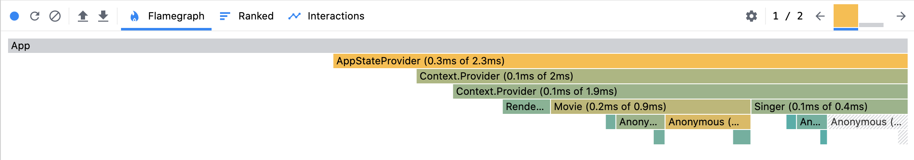

# React Context Performance

Sample app to demonstrate React Context rendering behavior.


## Build

```bash
$ yarn
$ yarn start
```

Now point your browser to http://localhost:3000/.

Open the console in Chrome DevTools to see render messages from different
components. As you type a new message, you will find that the `MessageEditor`
and the `MessageViewer` re-render, but the entire `App` doesn't. This proves
that only the context consumers are re-rendered when the context changes.

You can also turn on render highlighting in Chrome DevTools. Click on the
vertical menu button (3 dots), then More Tools > Rendering > Paint flashing.

Another option is to turn on render highlighting in React DevTools. Go to the
Components tab and select Settings > Highlight updates when components render.
However I found that React DevTools highlights the app component too on every
keystroke. Puzzled with this one!

A better option is to run the React DevTools profiler. The flamegraph below
clearly shows that only the `App` component is not rendered when typing a
message.


